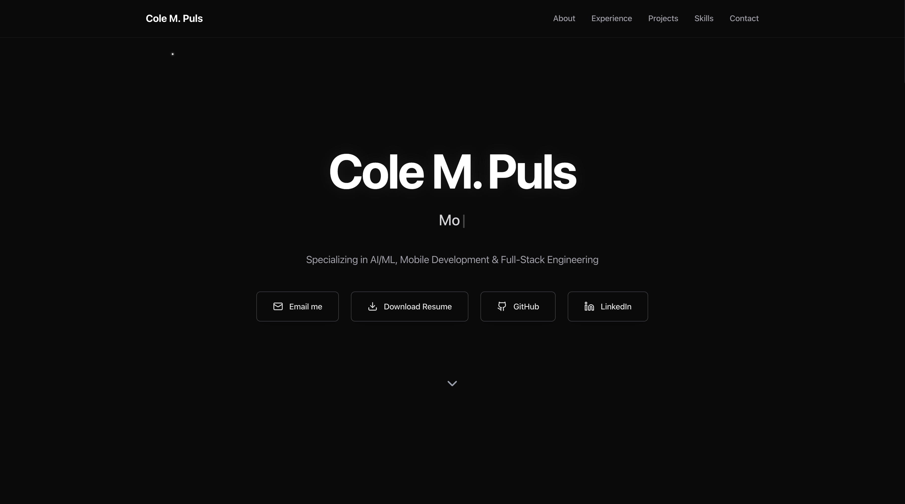
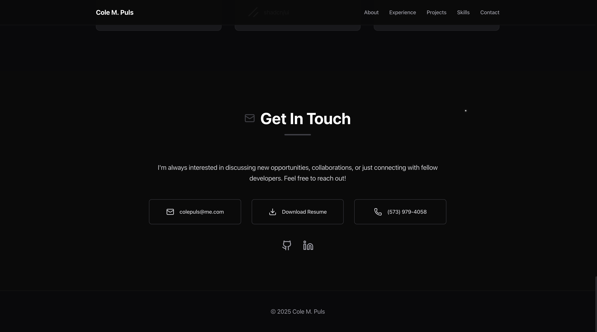

# Portfolio Website

A modern, responsive portfolio website showcasing my work as a Software Engineer, AI/ML Researcher, and Full-Stack Developer.

**View site:** [https://portfolio-site-nine-lake.vercel.app/](https://portfolio-site-nine-lake.vercel.app/)

## Features

- Smooth navigation header with scrolling to all sections
- Interactive animations and motion effects using Framer Motion
- Responsive design optimized for all devices
- Modern dark theme with glassmorphism effects
- Typewriter animation for dynamic job title display
- Cursor trail effects and interactive animations
- Professional sections: About, Experience, Projects, Skills, Contact
- Downloadable resume and social media links
- Performance optimized with Next.js App Router

## Screenshots

  

  

## Tech Stack

- Next.js 15.1.3 with App Router
- React 19.0.0
- TypeScript 5.6.3
- Tailwind CSS 3.4.17
- Framer Motion for animations
- Lucide React & React Icons
- Vercel for deployment

---

**Made by Cole Puls**
